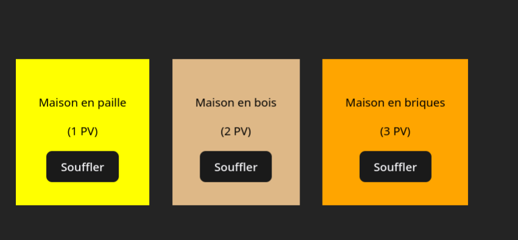
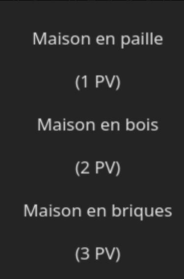
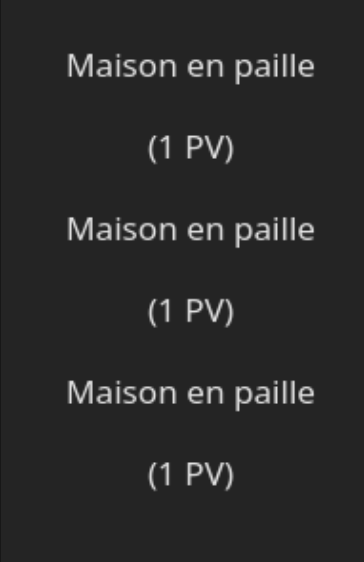
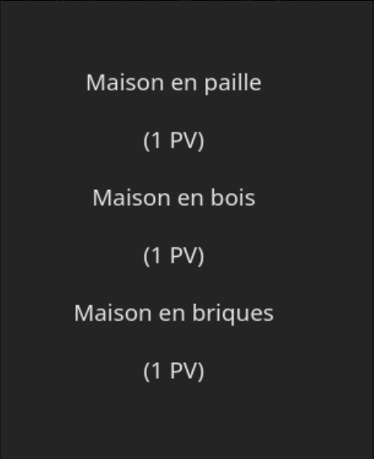
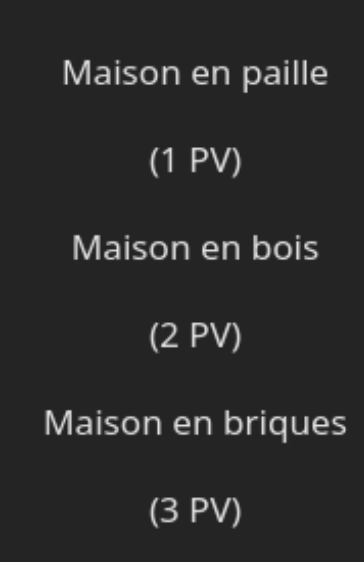
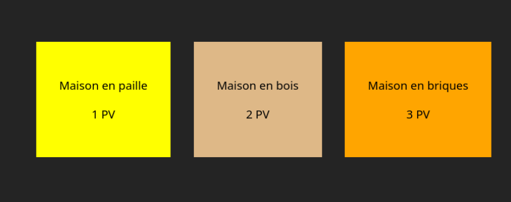
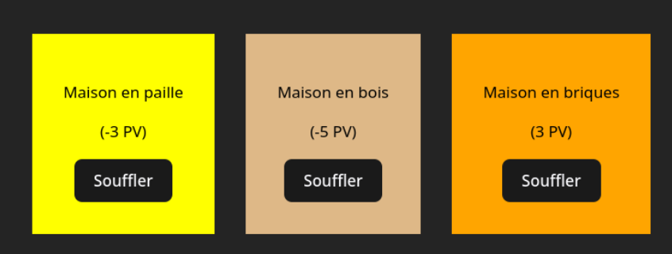
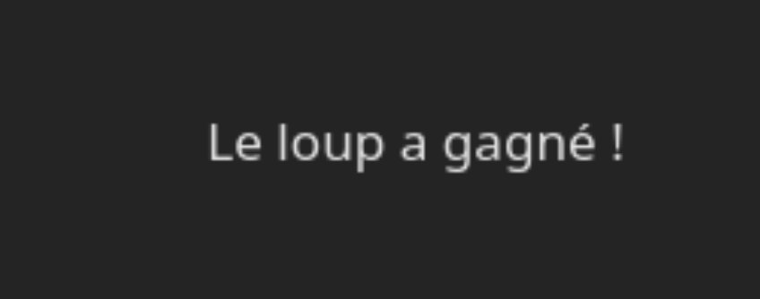

# TP React : Les Trois Petits Cochons

---

Le but de ce TP est d'apprendre les bases de React en créant les maisons des _Trois Petits Cochons_.

Il sera possible de les détruire en soufflant sur les maisons. Souffler une fois sur une maison lui retire 1 point de vie (PV). Quand la maison n'a plus de PV, elle disparaît. S'il n'y a plus de maisons, un message s'affiche indiquant que le loup a gagné.

Voici un aperçu de ce que l'on aura créé à l'issue du TP :



Durant ce TP, on abordera plusieurs notions importantes : les composants, les propriétés, la fonction `useState`, les événements et le rendu conditionnel.

## Pré-requis

- Node
- Dans le cadre de ce TP, on installera React à partir d'un dépôt GitHub. Pour aller plus loin et initialiser vous-même un projet React, utilisez un framework ou bien [Vite](https://vite.dev/guide).

## Création de l'application React

Après avoir cloné le projet sur votre ordinateur, exécutez les commandes suivantes pour installer les dépendances et lancer un serveur de développement :

```sh
npm install
npm run dev
```

Jetons un œil à la structure du projet. Rendez-vous sur `src/App.css`. Plusieurs styles ont été définis mais n'ont pas encore été utilisés. On va utiliser ces styles pour les maisons des _Trois Petits Cochons_, plus tard dans le TP.

Le plus intéressant se trouve dans `src/App.jsx` :

```jsx
import "./App.css";

export default function App() {
  return null;
}
```

On remarque que `App` est une fonction et qu'elle renvoie `null`. Dans React, la fonction `App` est ce qu'on appelle un composant. Voyons de quoi il s'agit.

## Les composants React

Dans React, il y a des composants, qu'on peut réutiliser. Un composant React, c'est tout simplement une fonction JavaScript qui retourne un élément JSX. Un élément JSX est une combinaison entre du code JavaScript et des balises HTML.

Un composant représente une partie de l'interface utilisateur.

Passons à la pratique pour mieux comprendre et faisons en sorte que App renvoie les maisons des _Trois Petits Cochons_ :

```jsx
import "./App.css";

export default function App() {
  return (
    <section>
      <div>
        <p>Maison en paille</p>
        <p>(1 PV)</p>
      </div>
      <div>
        <p>Maison en bois</p>
        <p>(2 PV)</p>
      </div>
      <div>
        <p>Maison en briques</p>
        <p>(3 PV)</p>
      </div>
    </section>
  );
}
```



Et voilà ! On utilise le composant `App` pour renvoyer le JSX contenant les trois maisons. Mais on n'utilise pas encore les composants à leur plein potentiel.

Les composants sont réutilisables : on peut donc refactoriser notre code en créant un composant `Maison`. On extrait le JSX qui définit une maison à l'intérieur de `App`. Dans le dossier `src/`, on crée un fichier `Maison.jsx` avec le JSX précédemment extrait :

```jsx
export default function Maison() {
  return (
    <>
      <p>Maison en paille</p>
      <p>(1 PV)</p>
    </>
  );
}
```

Pour afficher notre nouveau composant, on se rend sur `App.jsx`. On importe le composant `Maison`. On peut désormais utiliser le composant comme un élément JSX. Cela signifie qu'on peut créer autant de maisons que l'on souhaite.

```jsx
import "./App.css";
import Maison from "./Maison";

export default function App() {
  return (
    <>
      <Maison />
      <Maison />
      <Maison />
    </>
  );
}
```

Mais on rencontre un nouveau problème. On a trois maisons identiques au lieu d'en avoir une en paille, une en bois et une en briques.



Pour régler ce problème, on va avoir besoin des propriétés.

## Les propriétés

Les propriétés sont un moyen de personnaliser des composants React. Elles permettent de ne pas avoir à créer des composants similaires pour chaque modification de composant.

On ajoute la propriété `type` au composant Maison :

```jsx
import "./App.css";
import Maison from "./Maison";

export default function App() {
  return (
    <>
      <Maison type="paille" />
      <Maison type="bois" />
      <Maison type="briques" />
    </>
  );
}
```

Faire cela ne suffit pas. Dans `Maison.jsx`, il faut aussi recevoir la propriété `type`. On ajoute la propriété dans le paramètre du composant ainsi :

```jsx
export default function Maison({ type }) {
```

Pour afficher la valeur de l'argument `type` de façon dynamique, on a besoin des accolades `{` et `}`. Les accolades permettent de sortir du JSX pour mettre du JavaScript.

```jsx
export default function Maison({ type }) {
  return (
    <>
      <p>Maison en {type}</p>
      <p>(1 PV)</p>
    </>
  );
}
```

Super ! On a désormais trois maisons différentes.



Mais on peut faire mieux, en donnant à chaque maison un nombre de PV différent.

Avant de continuer, essayez d'ajouter au composant Maison une propriété `nbPvDefaut`, qui correspond au nombre de PV par défaut d'une maison. La maison en paille a 1 PV, la maison en bois a 2 PV et la maison en briques a 3 PV.

Voilà une solution :

On passe la propriété `nbPvDefaut` depuis `App` :

```jsx
import "./App.css";
import Maison from "./Maison";

export default function App() {
  return (
    <>
      <Maison type="paille" nbPvDefaut={1} />
      <Maison type="bois" nbPvDefaut={2} />
      <Maison type="briques" nbPvDefaut={3} />
    </>
  );
}
```

On ajoute en paramètre la propriété `nbPvDefaut` dans `Maison` :

```jsx
export default function Maison({ type, nbPvDefaut }) {
  return (
    <>
      <p>Maison en {type}</p>
      <p>({nbPvDefaut} PV)</p>
    </>
  );
}
```



## Styles CSS

Maintenant, chaque maison a son propre nombre de PV par défaut. Mais ces maisons ne sont pas très belles. Comme vu au début du TP, des classes CSS ont déjà été définies. Il ne reste plus qu'à les utiliser dans les composants `App` et `Maison` :

```jsx
import "./App.css";
import Maison from "./Maison";

export default function App() {
  return (
    <div className="village">
      <Maison type="paille" nbPvDefaut={1} />
      <Maison type="bois" nbPvDefaut={2} />
      <Maison type="briques" nbPvDefaut={3} />
    </div>
  );
}
```



```js
export default function Maison({ type, nbPvDefaut }) {
  return (
    <div className={type}>
      <p>Maison en {type}</p>
      <p>({nbPvDefaut} PV)</p>
    </div>
  );
}
```

## Créer des composants interactifs

Super ! C'est plus visuel maintenant, et on a bien trois maisons différentes. Cependant, on ne peut pas vraiment interagir avec les maisons. Faisons-en sorte que l'on puisse souffler dessus, comme le loup des _Trois Petits Cochons_. On ajoute un bouton "Souffler" au composant Maison

```jsx
export default function Maison({ type, nbPvDefaut }) {
  return (
    <div className={type}>
      <p>Maison en {type}</p>
      <p>({nbPvDefaut} PV)</p>
      <button>Souffler</button>
    </div>
  );
}
```

On commence par déclarer une fonction `handleSouffler` dans le composant `Maison`.

On ajoute la propriété `onClick` au bouton et on lui passe la fonction `handleSouffler`. Quand on clique dessus cela devrait afficher "soufflé" dans la console.

```jsx
export default function Maison({ type, nbPvDefaut }) {
  function handleSouffler() {
    console.log("soufflé");
  }

  return (
    <div className={type}>
      <p>Maison en {type}</p>
      <p>({nbPvDefaut} PV)</p>
      <button onClick={handleSouffler}>Souffler</button>
    </div>
  );
}
```

## La fonction `useState`

La notion d'état est très important en React. L'état garde de l'information qui change au cours du temps pour un composant donné.

On veut que lorsque l'on souffle sur une maison, ses PV soient réduits de 1. On va donc modifier la logique de `handleSouffler`. Mais d'abord, on va devoir utiliser une fonction spéciale `useState` pour créer une variable d'état `nbPvDefaut`. On a besoin d'utiliser `useState` pour que, lorsque `nbPvDefaut` est modifié, React détecte ce changement et fasse un re-rendering du composant Maison.

Les variables d'état sont déclarées en suivant le format suivant :

```jsx
const [variable, setVariable] = useState(valeurParDéfaut);
```

On importe `useState` au début du fichier. Puis on crée la variable d'état `nbPvActuels`, qui a comme valeur par défaut `nbPvDefaut.` On peut désormais rendre fonctionnel `handleSouffler` : on décrémente `nbPvActuels` quand on clique sur le bouton "Souffler".

```jsx
import { useState } from "react";

export default function Maison({ type, nbPvDefaut }) {
  const [nbPvActuels, setNbPvActuels] = useState(nbPvDefaut);

  function handleSouffler() {
    setNbPvActuels((nbPvActuels) => nbPvActuels - 1);
  }

  return (
    <div className={type}>
      <p>Maison en {type}</p>
      <p>({nbPvActuels} PV)</p>
      <button onClick={handleSouffler}>Souffler</button>
    </div>
  );
}
```

Super, on peut désormais souffler sur les maisons pour leur retirer 1 PV à chaque fois. Mais on a un problème : les maisons peuvent avoir des PV négatifs !



## Rendu conditionnel de composants

On veut cacher une maison lorsqu'elle n'a plus de PVs. Pour cela, rien de plus simple, car les composants sont des fonctions JavaScript. Il suffit d'ajouter une condition avant de retourner le JSX. Dans notre cas, on n'affique la maison que si son nombre de PV actuels est supérieur à 0 :

```jsx
import { useState } from "react";

export default function Maison({ type, nbPvDefaut }) {
  const [nbPvActuels, setNbPvActuels] = useState(nbPvDefaut);

  function handleSouffler() {
    setNbPvActuels((nbPvActuels) => nbPvActuels - 1);
  }
  if (nbPvActuels > 0) {
    return (
      <div className={type}>
        <p>Maison en {type}</p>
        <p>({nbPvActuels} PV)</p>
        <button onClick={handleSouffler}>Souffler</button>
      </div>
    );
  }
}
```

Et voilà ! On a créé l'essentiel de ce que l'on voulait faire en React. On a créé des maisons, grâce à des composants. On a personnalisé ces maisons avec des propriétés. Enfin, on a rendu ces maisons interactives avec `useState` : on peut souffler sur les maisons pour réduire leur point de vie. Les maisons peuvent être détruites (cachées) grâce au rendu conditionnel.

Il ne nous manque plus qu'à afficher le message "Le loup a gagné !" lorsque toutes les maisons ont été détruites. Nous ferons cela dans la section "Pour aller plus loin".

## Pour aller plus loin : faire remonter l'état du jeu vers le composant parent

Actuellement, l'état du jeu est partagé entre les trois maisons. Chaque maison sait si elle a été détruite, mais elle n'a pas d'informations sur l'état des autres maisons. Le composant `App` n'a aucun information sur l'état des maisons.

Comment faire pour que le composant `App` sache si le jeu est terminé (c'est-à-dire si toutes les maisons ont été détruites) ou non ? L'approche React serait de stocker l'état du jeu dans le composant parent `App`, au lieu de le stocker dans chaque `Maison`. Le composant `App` se chargerait alors de dire ce que doit afficher chaque `Maison` à travers une propriété.

Comme l'indique React sur sa page tutoriel :

> **Pour récupérer des données depuis de multiples enfants, ou pour que deux composants enfants communiquent l’un avec l’autre, déclarez plutôt leur état partagé dans leur composant parent. Le composant parent peut transmettre cet état à ses enfants _via_ les props. Ça permet de garder les enfants synchronisés entre eux, ainsi qu’avec leur parent.**

Dans `App.jsx`, on va donc déclarer une variable d'état `pvMaisons` qui est un objet avec le type de la maison en clé, et le nombre de PV en valeur.

```jsx
import { useState } from "react";
import ...

export default function App() {
		const [pvMaisons, setPvMaisons] = useState({
  		paille: 1,
  		bois: 2,
  		briques: 3,
		});

	...
}
```

On va utiliser cette nouvelle variable d'état pour les passer aux composants `Maison` à travers la propriété `nbPvDefaut`.

```jsx
import "./App.css";
import Maison from "./Maison";
import { useState } from "react";

export default function App() {
  const [pvMaisons, setPvMaisons] = useState({
    paille: 1,
    bois: 2,
    briques: 3,
  });
  return (
    <div className="village">
      <Maison type="paille" nbPv={pvMaisons["paille"]} />
      <Maison type="bois" nbPv={pvMaisons["bois"]} />
      <Maison type="briques" nbPv={pvMaisons["briques"]} />
    </div>
  );
}
```

On veut maintenant que la fonction `handleSouffler` mette à jour la variable d'état `pvMaisons` pour que `App` connaisse l'état de chaque `Maison`. L'état n'est visible qu'au sein du composant : on ne peut donc pas mettre à jour l'état de `App` directement depuis une `Maison`.

On va plutôt passer une fonction comme propriété du composant `Maison`. La `Maison` appellera cette fonction lorsque l'on cliquera sur le bouton "Souffler".

Eclaircissons les choses en regardant la documentation React :

> En React, `handleClick` est un **gestionnaire d’événement**. Les gestionnaires d’événements sont des fonctions qui :
>
> - Sont généralement définies au sein de vos composants.
> - Ont des noms qui commencent par `handle`, suivi du nom de l’événement.
>
> Par convention, on nomme souvent les gestionnaires d’événements en utilisant `handle` suivi du nom de l’événement. Vous verrez souvent `onClick={handleClick}`, `onMouseEnter={handleMouseEnter}`, etc.

On retire la variable d'état qui suit le nombre de PV actuel car les PV de chaque maison sont désormais gérés dans `App`. On peut donc renommer la propriété `nbPvDefaut` en `nbPv`. Il ne faut pas oublier de faire la même chose dans `App`.

```jsx
export default function Maison({ type, nbPv, onSouffler }) {
  if (nbPv > 0) {
    return (
      <div className={type}>
        <p>Maison en {type}</p>
        <p>({nbPv} PV)</p>
        <button onClick={onSouffler}>Souffler</button>
      </div>
    );
  }
}
```

On va désormais relier la propriété `onSouffler` à la fonction `handleSouffler`. Pour ce faire, on passe la fonction `handleSouffler` à `onSouffler` dans `App`.

```jsx
import { useState } from "react";
import "./App.css";
import Maison from "./Maison";

export default function App() {
  const [pvMaisons, setPvMaisons] = useState({
    paille: 1,
    bois: 2,
    briques: 3,
  });

  function handleSouffler() {
    console.log("soufflé");
  }

  return (
    <div className="village">
      <Maison
        type="paille"
        nbPv={pvMaisons["paille"]}
        onSouffler={handleSouffler}
      />
      <Maison
        type="bois"
        nbPv={pvMaisons["bois"]}
        onSouffler={handleSouffler}
      />
      <Maison
        type="briques"
        nbPv={pvMaisons["briques"]}
        onSouffler={handleSouffler}
      />
    </div>
  );
}
```

On va implémenter la logique de `handleSouffler`. D'abord, on se rend compte que l'on va avoir besoin d'un paramètre `type` pour `onSouffler` et `handleSouffler`.

```jsx
export default function Maison({ type, nbPv, onSouffler }) {
  if (nbPv > 0) {
    return (
      <div className={type}>
        <p>Maison en {type}</p>
        <p>({nbPv} PV)</p>
        <button onClick={() => onSouffler(type)}>Souffler</button>
      </div>
    );
  }
}
```

Et dans `App.jsx` : on fait une copie de l'objet `pvMaisons` appelée `newPvMaisons` à l'aide du spread ( `...` ) Javascript. Pourquoi faire une copie au lieu de modifier directement ? Parce que `pvMaisons` est une variable d'état et que React détecte un changement seulement lorsqu'on crée un nouvel objet. Cela permet aussi de garder l'historique. Pour plus d'informations, voir <https://fr.react.dev/learn/updating-objects-in-state>.

On retire 1 PV à la maison sur laquelle on a soufflé dans `newPvMaisons`. Enfin, on attribue `newPvMaisons` à `pvMaisons`.

```jsx
import { useState } from "react";
import "./App.css";
import Maison from "./Maison";

export default function App() {
  const [pvMaisons, setPvMaisons] = useState({
    paille: 1,
    bois: 2,
    briques: 3,
  });

  function handleSouffler(type) {
    const newPvMaisons = { ...pvMaisons };
    newPvMaisons[type] -= 1;
    setPvMaisons(newPvMaisons);
  }

  return (
    <div className="village">
      <Maison
        type="paille"
        nbPv={pvMaisons["paille"]}
        onSouffler={handleSouffler}
      />
      <Maison
        type="bois"
        nbPv={pvMaisons["bois"]}
        onSouffler={handleSouffler}
      />
      <Maison
        type="briques"
        nbPv={pvMaisons["briques"]}
        onSouffler={handleSouffler}
      />
    </div>
  );
}
```

OK, le jeu est à nouveau fonctionnel mais cette fois, l'état du jeu est visible par le composant `App` à travers la variable `pvMaisons`.

On va maintenant pouvoir afficher le message "Le loup a gagné !" quand toutes les maisons auront été détruites, c'est-à-dire lorsque tous les attributs de `pvMaisons` sont à 0. On va créer une fonction `checkLoupGagne` :

```jsx
import { useState } from "react";
import "./App.css";
import Maison from "./Maison";

export default function App() {
  const [pvMaisons, setPvMaisons] = useState({
    paille: 1,
    bois: 2,
    briques: 3,
  });

  function handleSouffler(type) {
    const newPvMaisons = { ...pvMaisons };
    newPvMaisons[type] -= 1;
    setPvMaisons(newPvMaisons);

    if (newPvMaisons[type] < 1) {
      console.log(checkLoupGagne(newPvMaisons));
    }
  }

  function checkLoupGagne(newPvMaisons) {
    for (let type in newPvMaisons) {
      if (newPvMaisons[type] > 0) {
        return false;
      }
    }

    return true;
  }

  return (
    <div className="village">
      <Maison
        type="paille"
        nbPv={pvMaisons["paille"]}
        onSouffler={handleSouffler}
      />
      <Maison
        type="bois"
        nbPv={pvMaisons["bois"]}
        onSouffler={handleSouffler}
      />
      <Maison
        type="briques"
        nbPv={pvMaisons["briques"]}
        onSouffler={handleSouffler}
      />
    </div>
  );
}
```

Il ne nous reste qu'à définir une variable d'état qui nous servira de flag de fin de partie. Ajoutons la variable d'état `finPartie`. Il faut une variable d'état (donc avec `useState`) et non une simple variable pour que React détecte un changement et raffiche le composant `App`.

On ajoute ensuite une condition avant de retourner les maisons :

```jsx
import { useState } from "react";
import "./App.css";
import Maison from "./Maison";

export default function App() {
  const [finPartie, setFinPartie] = useState(false);
  const [pvMaisons, setPvMaisons] = useState({
    paille: 1,
    bois: 2,
    briques: 3,
  });

  function handleSouffler(type) {
    const newPvMaisons = { ...pvMaisons };
    newPvMaisons[type] -= 1;
    setPvMaisons(newPvMaisons);

    if (newPvMaisons[type] < 1) {
      console.log(checkLoupGagne(newPvMaisons));
    }
  }

  function checkLoupGagne(newPvMaisons) {
    for (let type in newPvMaisons) {
      if (newPvMaisons[type] > 0) {
        return false;
      }
    }
    setFinPartie(true);
    return true;
  }
  if (finPartie) {
    return <p>Le loup a gagné !</p>;
  }

  return (
    <div className="village">
      <Maison
        type="paille"
        nbPv={pvMaisons["paille"]}
        onSouffler={handleSouffler}
      />
      <Maison
        type="bois"
        nbPv={pvMaisons["bois"]}
        onSouffler={handleSouffler}
      />
      <Maison
        type="briques"
        nbPv={pvMaisons["briques"]}
        onSouffler={handleSouffler}
      />
    </div>
  );
}
```

Voici le composant `Maison` final :

```jsx
export default function Maison({ type, nbPv, onSouffler }) {
  if (nbPv > 0) {
    return (
      <div className={type}>
        <p>Maison en {type}</p>
        <p>({nbPv} PV)</p>
        <button onClick={() => onSouffler(type)}>Souffler</button>
      </div>
    );
  }
}
```



Le jeu est finalement terminé ! Dans cette section "Pour aller plus loin", nous avons vu comment faire remonter l'état du jeu des composants enfants vers leur parent. Nous avons également vu les gestionnaires d'événement qui permettent aux enfants de communiquer au parent (contrairement aux propriétés qui communiquent du parent vers l'enfant).

Merci d'avoir suivi le TP !

Pour en apprendre plus sur React, n'hésitez pas à consulter les sources et notamment les tutoriels Mozilla et React.

## Sources

- Tutoriel Morpion, React, <https://react.dev/learn/tutorial-tic-tac-toe>
- Documentation React, React, <https://react.dev/learn>
- MDN Web Docs, Mozilla, <https://developer.mozilla.org/fr/docs/Learn_web_development/Core/Frameworks_libraries/React_getting_started>
- React JS 19 Full Course 2025, Javascript Mastery, [https://www.youtube.com/watch?v=dCLhUialKP](https://www.youtube.com/watch?v=dCLhUialKPQ&t=1070s)
